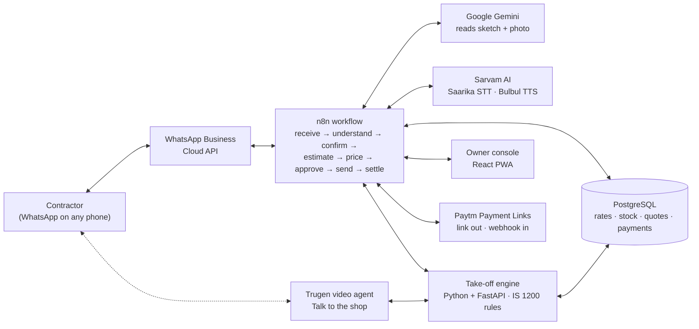
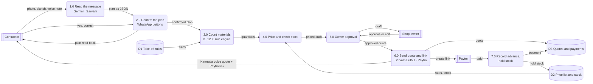
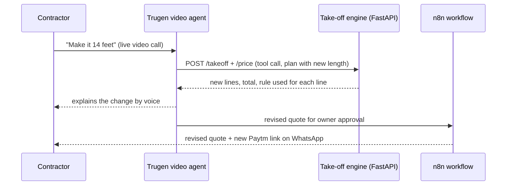

# Nakshe

**A contractor's pencil sketch on WhatsApp becomes a priced quote with a Paytm advance link, in under a minute, in Kannada.**

Team **Kernel Crew** · Hack Sprint 2026, Manipal University Bengaluru · Track 1: FinTech & Smart Commerce · Problem statement **PS21** (small merchants)

**Live prototype:** https://bhaskar-kumar-arya.github.io/nakshe/

---

## Contents
1. [The problem](#the-problem)
2. [The solution](#the-solution)
3. [Architecture](#architecture)
4. [Data flow diagram](#data-flow-diagram)
5. [Tech stack](#tech-stack)
6. [How the quantities are counted](#how-the-quantities-are-counted)
7. [Data model](#data-model)
8. [API and workflow](#api-and-workflow)
9. [Talk to the shop (Trugen video agent)](#talk-to-the-shop-trugen-video-agent)
10. [Built to be trusted](#built-to-be-trusted)
11. [24-hour build plan](#24-hour-build-plan)
12. [Demo on stage](#demo-on-stage)
13. [Impact we will measure](#impact-we-will-measure)
14. [Roadmap](#roadmap)
15. [What is in this repo](#what-is-in-this-repo)

---

## The problem
India's building-materials market was worth about **US$44.4 billion in 2025** (IMARC Group), and most of it is sold through small, independent hardware and cement shops.

A typical day at the counter:
- A contractor walks in with a hand sketch of a room. The owner counts bricks, cement bags and tile boxes on a calculator, between other customers. Counting materials for a full house by hand takes a trained estimator **6 to 10 hours** (Projul); a shop owner does a rough version of this for every enquiry.
- One slip in the maths and the shop either loses money on the order or loses the job to a faster shop.
- The quote is a scrap of paper. There is no advance and no commitment, so the contractor shops it around.

## The solution
Nakshe gives the shop a WhatsApp number that answers with a priced quote.

| Step | Who | What happens |
|---|---|---|
| 1. Send | Contractor | Sends a site photo, a hand sketch and a voice note in Kannada to the shop's WhatsApp number. No app to install. |
| 2. Read and confirm | Nakshe + contractor | Gemini reads the sketch; Sarvam transcribes the voice note. The bot reads the plan back ("12 × 10 ft, 10 ft high, 1 door, 1 window. Correct?") and the contractor taps **Yes**. |
| 3. Count and price | Nakshe | A rule engine using IS 1200 take-off rules counts every brick, bag and box. Rates and stock come from the shop's own price list. |
| 4. Approve and get paid | Owner + contractor | The owner checks the draft and approves with one tap. The contractor receives the quote, a spoken Kannada summary and a Paytm link for a 20% advance. Paying holds the stock for 48 hours. |

What changes for the shop:

| | Today | With Nakshe |
|---|---|---|
| Time to quote | Manual counting on a calculator | Under 1 minute |
| Commitment | A paper quote | Advance paid, stock held |
| Basket | Only what was asked | Forgotten add-ons suggested (spacers, grout, curing compound) |
| Language | The owner's handwriting | Spoken in the contractor's language |

---

## Architecture

One WhatsApp number in front; an n8n workflow runs the loop behind it.

**Design rules**
- **The AI reads, code calculates.** Gemini only turns the sketch into structured dimensions. Every quantity comes from tested rules, never from the model.
- **The contractor confirms first.** The plan is read back before any price is shown.
- **The owner has the last word.** Nothing leaves the shop without one tap.

---

## Data flow diagram

Level 1. External entities in dark boxes, processes numbered, data stores as D1–D3.

---

## Tech stack

| Layer | Tool | Role |
|---|---|---|
| Channel | WhatsApp Business Cloud API | Where contractors already send photos and voice notes |
| Orchestration | **n8n** (partner) | Webhook-driven workflow with retries and logs |
| Vision | **Google Gemini** (partner) | Sketch and site photo → JSON: dimensions, openings, finishes, each with a confidence score |
| Indian-language voice | **Sarvam AI** (partner) | Saarika speech-to-text for the voice note; Bulbul text-to-speech for the spoken quote. Kannada, Hindi, Tamil, Telugu and more |
| Estimation engine | Python + FastAPI | IS 1200 take-off rules, unit-tested on known rooms |
| Data | PostgreSQL | Price list, stock, quotes and payments |
| Payments | **Paytm Payment Links** (partner) | Advance link inside the quote; webhook marks it paid and holds stock |
| Owner console | React PWA | Approve, edit a rate, track advances; runs on the counter's Android phone |
| Video agent | **Trugen AI** (partner) | "Talk to the shop": a real-time video assistant that explains the quote and re-prices on request |

---

## How the quantities are counted

The engine follows IS 1200 (Indian Standard method of measurement of building works) thumb rules. Inputs come from the confirmed plan; nothing is guessed.

| Item | Rule |
|---|---|
| Wall volume | centre-line perimeter × height − openings (door 3×7 ft, window 4×4 ft) × wall thickness (9 in = 0.23 m) |
| Bricks | wall volume × 500 per m³ (190×90×90 mm modular brick with mortar) + 5% breakage |
| Mortar (1:6) | dry volume = 30% of wall volume; cement = dry volume ÷ 7 × 1,440 kg/m³ ÷ 50 kg per bag |
| Plaster (12 mm, 1:4, both faces) | wet volume = area × 0.012 m; dry = wet × 1.33; cement = dry ÷ 5 × 1,440 ÷ 50 |
| M-sand | mortar sand (6/7 of dry volume) + plaster sand (4/5 of dry volume) × 1.6 t/m³ |
| Vitrified tiles 600×600 | floor area + 8% cutting ÷ 15.5 sq ft per box of 4 |
| Tile adhesive (20 kg) | floor area ÷ 45 sq ft per bag |

**Worked example (Ravi's sketch):** 12 × 10 ft room, 10 ft walls, 9-inch brick, 1 door, 1 window, plaster on both faces, 2×2 ft tiles.

| Item | Quantity | Rate (Bengaluru, Sep 2026) | Amount |
|---|---|---|---|
| Bricks | 4,860 | ₹9 | ₹43,740 |
| Cement OPC 53 | 19 bags | ₹400 | ₹7,600 |
| M-sand | 5.5 t | ₹1,300 / t | ₹7,150 |
| Vitrified tiles 2×2 | 9 boxes | ₹780 | ₹7,020 |
| Tile adhesive | 3 bags | ₹450 | ₹1,350 |
| **Total (incl. GST)** | | | **₹66,860** |
| 20% advance | | | ₹13,372 |

Anything the sketch does not show, such as a roof slab or lintel, is **flagged and asked for**, not assumed.

---

## Data model

| Table | Key fields |
|---|---|
| `shops` | id, name, whatsapp_number, language, gst_no |
| `products` | id, shop_id, name, unit, rate, cost, stock_qty, supplier (own / partner kiln / yard) |
| `contractors` | id, shop_id, name, phone, language |
| `plans` | id, contractor_id, sketch_url, voice_url, transcript, plan_json, confidence, confirmed_at |
| `quotes` | id, plan_id, lines_json, total, margin, status (draft / approved / sent / paid / expired), valid_until |
| `payments` | id, quote_id, paytm_order_id, amount, status, paid_at |
| `stock_holds` | id, quote_id, product_id, qty, held_until |

---

## API and workflow

**Take-off engine (FastAPI)**

| Method | Path | Purpose |
|---|---|---|
| `POST` | `/takeoff` | Plan JSON → line items with quantities and the rule used for each |
| `POST` | `/price` | Line items + shop id → priced lines, stock status, margin |
| `POST` | `/quotes/{id}/approve` | Owner approval (from the console) |
| `POST` | `/webhooks/paytm` | Payment status → mark paid, create stock holds |

**n8n workflow**
1. WhatsApp webhook receives media and voice note.
2. Sarvam Saarika transcribes the voice note; Gemini returns plan JSON with confidence scores.
3. Low-confidence fields are asked about; the plan is read back with **Yes / Change** buttons.
4. On **Yes**, call `/takeoff` then `/price`; save the draft quote.
5. Notify the owner console; wait for approval (the owner can edit a rate).
6. Send the quote card, a Sarvam Bulbul voice summary and a Paytm payment link.
7. On the Paytm webhook, record the payment and hold stock for 48 hours; send a receipt.
8. If not paid in 3 days, send one reminder and expire the quote.

---

## Talk to the shop (Trugen video agent)

Contractors trust a person more than a table of numbers. Under every quote there is a **Talk to the shop** button that opens a live video call with the shop's AI assistant, built on Trugen's real-time conversational video agents.

**What the contractor can do on the call**
- Ask why: "Why 19 bags of cement?" The assistant explains the rule ("mortar for 9.25 m³ of brickwork plus 12 mm plaster on both faces") in plain words.
- Change the job: "Make it 14 feet." The assistant calls our take-off API, and the revised quote and a new Paytm link arrive on WhatsApp while they are still talking.
- Compare options: "Is there a cheaper cement?" The assistant offers in-stock substitutes from the shop's price list.
- Speak naturally in Kannada, Hindi or English.

**How it fits the architecture**

- **Knowledge base:** the confirmed plan, the quote with the rule behind each line, the shop's price list, delivery and payment terms.
- **Tools the agent can call:** `/takeoff`, `/price`, and "send revised quote", which still goes through the owner's one-tap approval.
- **Same rule as everywhere else:** the agent explains and collects changes; quantities still come only from the rule engine, and the owner still approves what is sent.
- **Language:** Trugen's multilingual agents; Sarvam handles Kannada speech where it is stronger.

**Build plan:** a stretch goal for the last hours of the event, after the core WhatsApp-to-payment loop works. The agent is configured through Trugen's API with the quote as its knowledge base and our FastAPI endpoints as tools.

---

## Built to be trusted
- **Every number is checked before it is sent.** The contractor confirms the dimensions, tested rules do the counting, and the owner approves with one tap.
- **Understands how contractors really talk.** Sarvam's Indian-language speech models handle Kannada, Hindi and mixed speech, with tap-to-confirm buttons and typing as backups.
- **Prices always current.** The owner updates a rate by voice ("cement 410") or from the price sheet, and every quote is valid for 3 days.
- **Every quantity is traceable.** The owner console shows how each line was counted.

---

## 24-hour build plan

| Hours | Work |
|---|---|
| 0–4 | WhatsApp number and the n8n pipeline, end to end with dummy data |
| 4–10 | Gemini sketch reading and Sarvam voice, tested on 10 hand-drawn rooms |
| 10–16 | Take-off rule engine and the shop's price list |
| 16–20 | Paytm advance links and the owner console |
| 20–24 | Hardening the demo, plus a recorded fallback video; stretch: Trugen "Talk to the shop" video agent |

## Demo on stage
A judge draws a room on paper and sends it from their own phone. A Kannada voice quote and a Paytm advance link come back in under a minute, and the owner console shows exactly how every quantity was counted.

## Impact we will measure
Targets for a 2-week pilot with 3 Bengaluru shops:

| Measure | Target |
|---|---|
| Time from sketch to quote | under 1 minute |
| Quotes converted with an advance paid | 30% |
| Basket size from suggested add-ons | +5% |
| Quantities guessed by the LLM | 0 (all rule-based and traceable) |

**How it earns:** ₹499 a month per shop, plus a fee from partner brick and sand suppliers for orders routed to them.

## Roadmap
- More job types: roof slab, bathroom (tiles + plumbing), painting.
- Substitute suggestions when an item is out of stock, with the margin for each option.
- Credit for trusted contractors, using their payment history.
- Supplier ordering: route brick and sand orders to partner yards automatically.

---

## What is in this repo
- `index.html`: the interactive prototype. It contains the WhatsApp flow, the owner console and a working version of the take-off rule engine. Change the room in "What the AI read" and the sketch, the Kannada read-back and the full quote recalculate.
- `sketch.jpg`: Ravi's hand sketch used in the demo.
- `demo.gif`: a 24-second walkthrough of the prototype.

The production build (WhatsApp, Gemini, Sarvam, n8n, Paytm) is what we will build at the event.

**Sources:** IMARC Group, India Building Materials Market (2025); Nexdigm, India Hardware Stores Retail; Projul, Construction Takeoff Guide; Bengaluru material prices from public price listings, September 2026.
