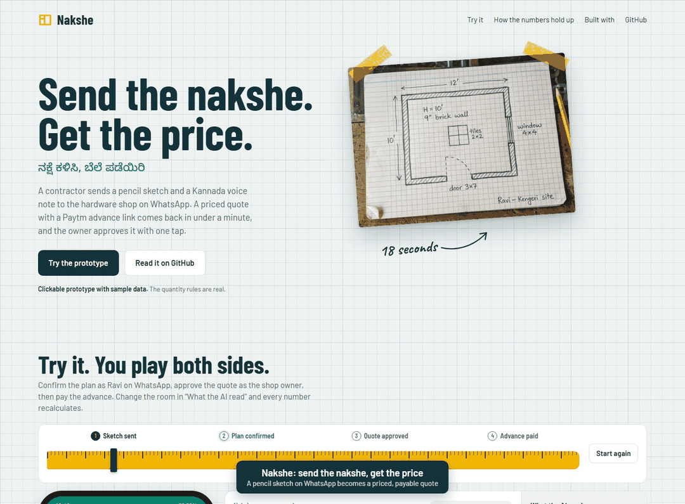

# Nakshe

**A contractor's pencil sketch on WhatsApp becomes a priced quote with a Paytm advance link, in under a minute, in Kannada.**

Team **Kernel Crew** · Hack Sprint 2026, Manipal University Bengaluru · Track 1: FinTech & Smart Commerce · Problem statement **PS21** (small merchants)

**Live prototype:** https://bhaskar-kumar-arya.github.io/nakshe/

## The problem
Contractors walk into small hardware and building-material shops with a hand sketch. The owner counts bricks, cement bags and tile boxes on a calculator, between customers. It is slow, one slip in the maths costs money, and the quote is a scrap of paper: no advance, no commitment, so the contractor shops it around.

## The solution
1. **Send:** the contractor sends a site photo, a hand sketch and a voice note to the shop's WhatsApp number.
2. **Read and confirm:** Gemini reads the sketch, Sarvam transcribes the Kannada voice note, and the bot reads the plan back for the contractor to confirm.
3. **Count and price:** a rule engine using IS 1200 take-off rules counts every brick, bag and box; rates and stock come from the shop's own price list.
4. **Approve and get paid:** the owner approves with one tap; the contractor gets a spoken Kannada quote and a Paytm advance link, and paying holds the stock.

**Built to be trusted:** the AI only reads, tested rules do the counting, the contractor confirms the dimensions, and the owner approves before anything is sent.

## Tech stack
| Layer | Tool |
|---|---|
| Channel | WhatsApp Business Cloud API |
| Orchestration | n8n |
| Vision | Google Gemini (sketch and photo to structured JSON) |
| Indian-language voice | Sarvam AI (Saarika speech-to-text, Bulbul text-to-speech) |
| Estimation engine | Python + FastAPI, IS 1200 take-off rules |
| Data | PostgreSQL (rates, stock, quotes, payments) |
| Payments | Paytm Payment Links + webhook |
| Owner console | React PWA |

## Data flow
Contractor → (1) read message → (2) confirm plan → (3) count materials [D1 take-off rules] → (4) price and check stock [D2 price list and stock] → (5) owner approval → (6) send quote and Paytm link → Paytm → (7) record advance and hold stock [D3 quotes and payments].

## What is in this repo
`index.html` is the interactive prototype: the WhatsApp flow, the owner console and a working version of the take-off rule engine. Change the room size in "What the AI read" and the sketch, the Kannada read-back and the full quote recalculate. The production build (WhatsApp, Gemini, Sarvam, n8n, Paytm) is what we will build at the event.

Example quote (12 × 10 ft room, 10 ft walls, 9-inch brick, plaster, 2×2 tiles): 4,860 bricks, 19 cement bags, 5.5 t M-sand, 9 tile boxes, 3 adhesive bags = **₹66,860**, with a 20% advance of ₹13,372. Bengaluru market rates, September 2026.
